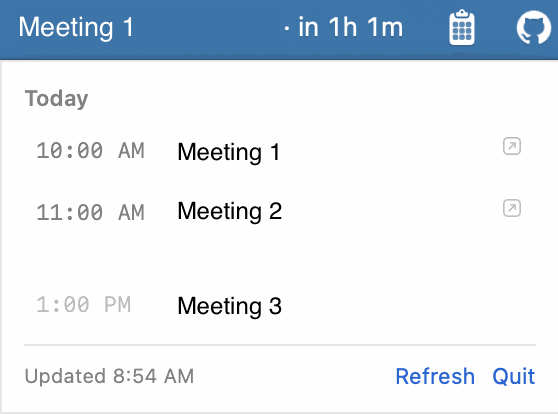

# meeting-notification-bar

1. Menu bar countdown to your next meeting
2. Google Docs → local markdown sync (one-way)

Both run entirely on your Mac, sharing one Google login.
How to use: 
- Click to open/close the dropdown. 
- Click a meeting to open its call.



## No model, no cloud

Verify it yourself:

```bash
grep -rin 'claude\|anthropic\|openai\|mcp' --include='*.js' --include='*.swift' --include='*.sh' .
launchctl list | grep meeting-notification-bar
```

Every host the code reaches: `googleapis.com`, `oauth2.googleapis.com`, `accounts.google.com` (consent), `127.0.0.1` (redirect listener). Nothing else.

## Requirements

- macOS 13+
- Node 18+ — no dependencies, no `npm install`
- Command Line Tools (`xcode-select --install`)
- A Google account

## Install (~15 min)

```bash
git clone https://github.com/llinkas13/meeting-notification-bar.git
cd meeting-notification-bar

# 1. Make your own OAuth client — docs/google-cloud-setup.md, ~10 min
mkdir -p .secrets
mv ~/Downloads/client_secret_*.json .secrets/oauth-client.json

# 2. Everything else — ~5 min (build + consent)
bash setup.sh                 # menu bar only
bash setup.sh --with-sync     # menu bar + Drive sync every 30 min
bash setup.sh --check         # verify an existing install
```

Safe to re-run. Never overwrites `config.json` or re-asks for consent.

## Repo layout

```
meeting-notification-bar/
├── bin/                       entry-point scripts
│   ├── auth.js                --login / --check / --logout
│   ├── fetch-events.js        today's events → JSON on stdout
│   └── sync-drive-docs.js     Docs → outputDir/*.md, with cursor + seen-list
├── lib/                       pure logic, no side effects at import
│   ├── google-auth.js         OAuth loopback consent, token refresh
│   ├── calendar.js            events.list + joinable URL extraction
│   ├── drive.js                files.list across drives, Doc → markdown export
│   ├── config.js              defaults, timezone resolution
│   └── paths.js               shared file locations
├── menubar/                   the Swift menu bar app
│   ├── NextMeeting.swift       NSStatusItem + SwiftUI panel
│   ├── refresh-events.sh       runs the fetcher, writes JSON atomically
│   └── build.sh                swiftc → .app bundle, no Xcode project
├── launchd/                   Drive-sync LaunchAgent installer
├── docs/
│   └── google-cloud-setup.md   OAuth client setup, 6 steps
├── test/                      node --test fixtures + specs
├── config.example.json        copy to config.json
├── setup.sh                   installer
├── uninstall.sh               remove app + agents (--purge for cache/logs/token)
└── README.md
```

Data lives outside the repo:

```
~/Library/Application Support/meeting-notification-bar/   events.json, drive-sync-state.json
~/Library/Logs/meeting-notification-bar/                   menubar.log, drive-sync.log, *.launchd.log
```

## Configuration

`config.json`, copied from `config.example.json`. Every key optional.

| Key | Default | Notes |
|---|---|---|
| `calendarId` | `primary` | Or any calendar your account can read — no second consent. |
| `driveSync.titleContains` | `Notes by Gemini` | Drive title substring to mirror. |
| `driveSync.outputDir` | `~/Documents/meeting-notes` | Where markdown lands. |
| `driveSync.lookbackDays` | `30` | First-run window; a saved cursor takes over after. |
| `driveSync.maxPerRun` | `60` | Cap per run. |
| `driveSync.exclude` | none | Case-insensitive regex on title, e.g. `orientation\|1:1\|HR`. |

Timezone is never a config key — it always follows the Mac (`$TZ`, else system zone), so it can't drift from the laptop. `bin/auth.js --check` prints the zone in use.

## Daily use

Nothing — it starts at login and refreshes itself. When something looks wrong:

```bash
node bin/auth.js --check                                          # is Google answering?
~/Applications/NextMeeting.app/Contents/MacOS/NextMeeting --print   # what the menu bar thinks
tail -20 ~/Library/Logs/meeting-notification-bar/menubar.log
```

### Stale vs. broken

A failed fetch keeps the last good data instead of blanking — so a broken install and a working one can draw the same thing. Three tells:

- Menu bar: `⚠` appended when data is >10 min old or the last fetch failed.
- Dropdown footer: `Updated 9:41 AM` (grey, fine) vs. `Stale · 9:41 AM` / `Fetch failed · 9:41 AM` (orange).
- `--print`'s `freshness:` line, with a `STALE` note when it applies.

`not authorized yet` in the log → `node bin/auth.js --login`. Check `*.launchd.log` too — it catches failures before the script's own logging starts.

Retries back off on a ladder (15s, 60s, then every 5 min). Roughly one `FAIL` line per 5 min during an outage is healthy; much faster means the backoff itself is broken:

```bash
L=~/Library/Logs/meeting-notification-bar/menubar.log
grep -c FAIL "$L"
grep -E '^[0-9]{4}-' "$L" | awk '{print substr($2,1,5)}' | uniq -c | tail
```

Moved or renamed the checkout? Expect `not authorized yet` — the bundle stamps the absolute path in at build time. Rebuild from the new location; `setup.sh --check` flags the mismatch.

### Drive sync, by hand

```bash
node bin/sync-drive-docs.js --dry-run
node bin/sync-drive-docs.js
node bin/sync-drive-docs.js --since 2026-07-01T00:00:00Z
node bin/sync-drive-docs.js --reset     # forget the cursor, re-scan everything
```

Never overwrites an existing file without `--force`. Read-only Drive scope, so it can't write back even by mistake.

### Overrides

- `$MNB_EVENTS_FILE` — events.json location. Set for both the app and `refresh-events.sh`, or they'll disagree.
- `$MNB_HOME` — points the Node side at a different checkout (stamped into the bundle by `build.sh`).
- `$MNB_CONFIG` — points at a different `config.json` (used by the test suite).


## Tests

```bash
node --test                                                          # 15 checks, no network/GUI
menubar/build/NextMeeting.app/Contents/MacOS/NextMeeting --selftest    # 43 checks, no network/GUI
```

Neither talks to Google. The three lines that do are exercised by `node bin/auth.js --check`.

## Uninstall

```bash
bash uninstall.sh            # remove app + both LaunchAgents
bash uninstall.sh --purge    # also delete cached events, sync state, logs, token
```

Synced notes are never touched — revoke the Google grant at <https://myaccount.google.com/permissions>.

## Known rough edges

- Countdown rounds seconds up: 19m59s reads `19m left`.
- Today only — tomorrow's 9am shows as `No meetings` once today's list ends.
- Multi-monitor: panel opens on the screen with the menu bar item, clamped to that screen.
- Running the `meeting-vault` variant too? Both want `~/Applications/NextMeeting.app` — `build.sh --install` refuses rather than clobber the other.

## Things that will break if edited

1. **A GUI app can't find `node`.** No PATH shims from Finder/LaunchAgent launch — `refresh-events.sh` rebuilds a usable PATH; that's why the app shells out instead of running `node` directly.
2. **The bundled script is a shim, not a copy.** It can't walk up from `Contents/Resources` to find the checkout — `build.sh` stamps the absolute path as `MNB_HOME`. Editing `refresh-events.sh` takes effect without rebuilding.
3. **Don't fetch on the 1-second timer.** It only recomputes the display string; real refresh is every `REFRESH_INTERVAL` (300s) plus on wake.
4. **Keep the monospaced-digit font.** Proportional digits reflow the menu bar on every tick.
5. **The dropdown is a hand-built `NSPanel`, not `NSPopover`.** A popover leaves a gap for its arrow that can't be turned off. Consequence: `canBecomeKey` must be overridden, and the global close-monitor must skip clicks on the status item — otherwise a click both closes and reopens the panel.
6. **`conferenceDataVersion=1` doesn't fix a missing join link.** It's a write-path param; `events.list` ignores it. No `entryPoints` means no conferencing, period.
7. **Esc only works because the app self-activates.** The local key monitor only sees events delivered to an active app, and `.accessory` apps aren't active by default — `openPanel()` calls `NSApp.activate`. A short grace window (`suppressResignUntil`) stops the resulting resign-active notification from instantly closing the panel.
8. **The panel closes on more than stray clicks.** `didResignActiveNotification` and space-change both call `closePanel()`. Route any new "left the app" signal through the same function.
9. **`closePanel()` defers releasing the content view** — it can be called mid-teardown of the very view triggering it. A generation counter (`panelGeneration`) stops a fast close/reopen from wiping the new view.
10. **Timezone can change without a sleep event.** `NSSystemTimeZoneDidChange` resets the cached zone and re-renders; nothing else stores a `Calendar`/`DateFormatter` across calls, so this is the one place staleness could hide.
11. **Dropdown height is clamped and scrolls, on purpose.** A busy day (12+ meetings) used to grow the panel off-screen and cover the earliest meetings. `clampedPanelHeight` caps it; the row `ScrollView` absorbs the squeeze so the footer stays put.

## Licence

MIT. See [LICENSE](LICENSE).
